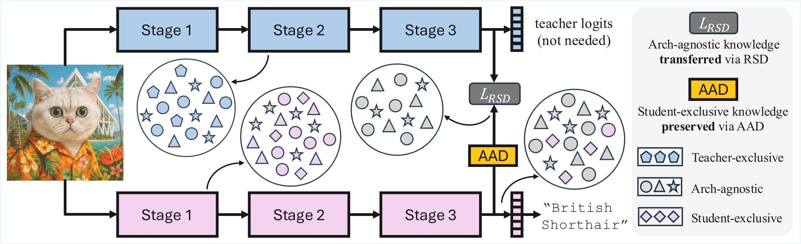

<h1 align="center">
 [ICCV 2025 Highlight] <i>Cross-Architecture Distillation Made Simple with Redundancy Suppression</i> </h1>
<p align="center">

This repository contains a PyTorch implementation of **Redundancy Suppression Distillation (RSD)** introduced in the paper 
<i>Cross-Architecture Distillation Made Simple with Redundancy Suppression (ICCV 2025)</i>.

RSD is a simple method for cross-architecture knowledge distillation,
where the knowledge transfer is cast into a redundant information suppression formulation.
Existing methods introduce sophisticated modules, architecture-tailored designs, 
and excessive parameters, which impair their efficiency and applicability.
We propose to extract the architecture-agnostic knowledge in heterogeneous representations
by reducing the redundant architecture-exclusive information. To this end, we present a
simple RSD loss, which comprises cross-architecture invariance maximisation and feature 
decorrelation objectives. To prevent the student from entirely losing its architecture-specific
capabilities, we further design a lightweight module that decouples the RSD objective from the
student's internal representations. 


<p align="center">
  
</p>


## Preparation

1. Clone the repository to your local workspace:

    ```
    git clone https://github.com/spacewanderx/RSD.git
    ```

2. Configure the environment:
    ```
    conda create --name rsd python=3.8
    conda activate rsd
    pip install torch==1.7.1+cu110 torchvision==0.8.2+cu110 torchaudio==0.7.2 -f https://download.pytorch.org/whl/torch_stable.html
    pip install -r requirements.txt
    ```
    Note that other torch versions may also work.


3. Prepare the dataset
   
    The CIFAR-100 dataset will be automatically downloaded to `./data/cifar100/`.


4. Prepare the pretrained teacher models:

   Download the pretrained models to `./pretrained/`
   <div align="center">

    | Teacher    | Acc. (%) | Pretrained Models                                                                                       |
    |------------|----------|----------------------------------------------------------------------------------------------------------|
    | Swin-T     | 89.26    | [swin_tiny_patch4_window7_224_cifar100.pth](https://drive.google.com/file/d/1B-_tp0Z_qc_RPFqD2cVASNXODzYSQHv4/view?usp=sharing)   |
    | ViT-S      | 92.44    | [vit_small_patch16_224_cifar100.pth](https://drive.google.com/file/d/1NydXc3w2DEjLFRSC1ibHBulINQfYGxqM/view?usp=sharing) |
    | Mixer-B/16 | 87.62    | [mixer_b16_224_cifar100.pth](https://drive.google.com/file/d/1Tv5Il0cZvOYspTc9UQi_6r0KNCp1SDoE/view?usp=sharing)  |
    | ConvNeXt-T | 88.42    | [convnext_tiny_cifar100.pth](https://drive.google.com/file/d/1KFW1A6gIXgdcL3P3fPuMDQau0-XQpK8e/view?usp=sharing)  |

    </div>


## Training

We provide the scripts and models for CIFAR-100 experiments. To train a ResNet18 student using Swin-T teacher on CIFAR-100 on a single node with 2 GPUs, run:

```
python -m torch.distributed.launch --nproc_per_node=2 train.py /path/to/cifar100 --config configs/cifar/cnn.yaml --model resnet18 --teacher swin_tiny_patch4_window7_224 --teacher-pretrained /path/to/teacher_checkpoint --num-classes 100 --distiller ofa --ofa-eps 1.0
```

You may also train with the bash command:

```
bash train.sh 2
```

## Evaluation

The distilled student model will be automatically evaluated on the validation set during training. Manual evaluation is also supported. For example, to evaluate the pretrained Swin-T model, run:
```
python validate.py data/cifar100 --dataset cifar100 --num-classes 100 --model swin_tiny_patch4_window7_224 --checkpoint pretrained/swin_tiny_patch4_window7_224_cifar100.pth```
```

## Custom usage

You may easily customise the code for your own method and experiments.

Method: to implement your own knowledge distillation method, follow the examples in the `./distillers` folder.

Architecture: to support arbitrary model architectures, follow the examples in the `./custom_model` folder. If intermediate features of the new model are required for KD, rewrite its `forward()` method following examples in the `./custom_forward` folder.

## Acknowledgement

This project is developed using the [timm](https://github.com/rwightman/pytorch-image-models) and the [mdistiller](https://github.com/megvii-research/mdistiller) library, and is based on [OFA-KD](https://github.com/Hao840/OFAKD) (NeurIPS 2024).

## Reference

If you find this project useful, please consider citing it:

```
@inproceedings{zhang2025rsd,
  author    = {Weijia Zhang and Yuehao Liu and Wu Ran and Chao Ma},
  title     = {Cross-Architecture Distillation Made Simple with Redundancy Suppression},
  booktitle = {ICCV},
  year      = {2025}
}
```
